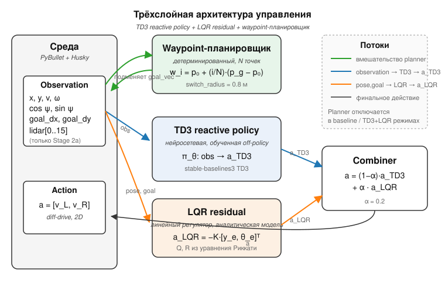
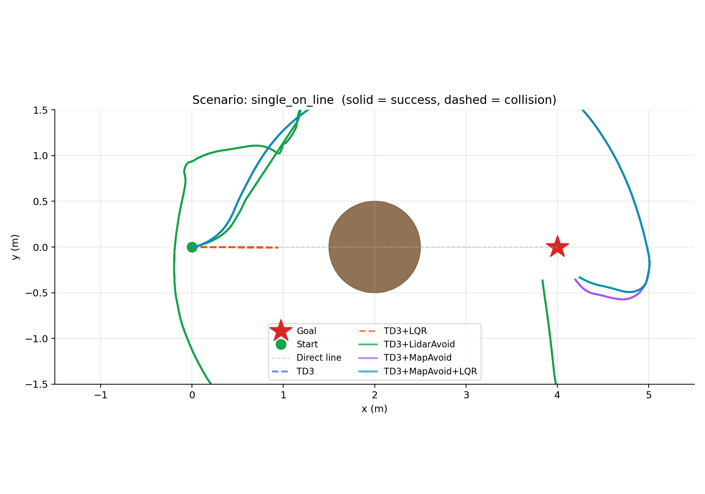
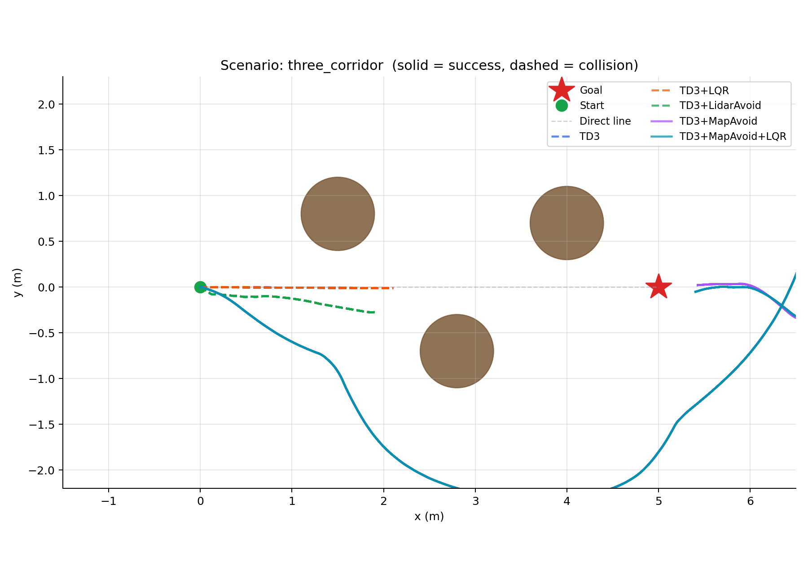
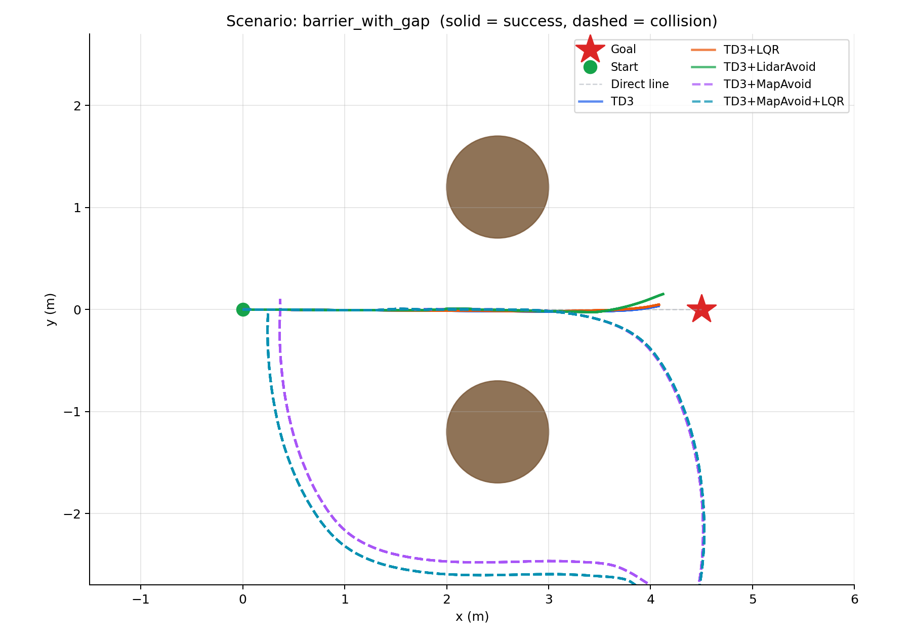

# Иерархическая когнитивная архитектура управления мобильным роботом

Воспроизводимая реализация к статье **DCCN-2026** «Иерархическая когнитивная
архитектура управления для мобильной робототехнической платформы».
Поданная (8-страничная) версия: [`paper/latex/paper_8p.pdf`](paper/latex/paper_8p.pdf).

Рассматривается навигация мобильного агента с дифференциальным приводом (Husky)
к цели на плоской арене с препятствиями известной геометрии и переменным трением.
Реализована **трёхуровневая иерархическая (STRL) архитектура**, и количественно
измерен функциональный вклад каждого уровня на 65 ablation-конфигурациях
($7\times5 + 6\times5$, по $n=10$ детерминированных запусков).

## Архитектура



| Уровень | Что | Реализация |
|---|---|---|
| **Нижний (реактивный)** | стратегия TD3, действует на каждом шаге | [`train_td3_obstacle.py`](train_td3_obstacle.py), [`envs/husky_obstacle_env.py`](envs/husky_obstacle_env.py) |
| **Средний (тактический)** | LQR-residual, сглаживание курса ($e_y=0$, α=0.2) | [`controllers/lqr_diff_drive.py`](controllers/lqr_diff_drive.py) |
| **Верхний (супервизорный)** | обход по карте MapAvoid (гистерезис 1.5/2.5 м) | [`controllers/map_aware_avoidance.py`](controllers/map_aware_avoidance.py) |
| *сравнение* | сенсорный обход LidarAvoid (по сырому лидару) | [`controllers/obstacle_avoidance.py`](controllers/obstacle_avoidance.py) |

Конечное действие: при активном верхнем уровне ($\mathbb{1}_{map}=1$) он замещает
нижний+средний; иначе $a = \mathrm{clip}(a_{TD3} + \alpha\,u_{LQR})$.
Наблюдение нижнего уровня содержит лидар LDS-01 (360 лучей → min-pool в 16 секторов).

## Эксперименты

Сервер 8×Ryzen 9 9950X / 16 ГБ, PyBullet headless, 6 сред через `SubprocVecEnv`,
сиды 200–209, $n=10$. Метрика — доля успеха. Пять режимов:
`TD3 / +LQR / +LidarAvoid / +MapAvoid / +MapAvoid+LQR`.

### Эксперимент A — геометрия препятствий ([`experiments/exp_a_final.py`](experiments/exp_a_final.py))

7 конфигураций × 5 режимов (табл. 1 статьи). Ключевое: верхний уровень разгружает
нижний при точной карте (`single_on_line`, `two_offset`, `three_corridor`,
`wide_obstacle`), но мешает там, где геометрия модели расходится с реальной
(`barrier_with_gap` — проход проходится только нижним/сенсорным уровнем). `slalom`
не решается никем — граница применимости.

<p>



</p>

Видеодемонстрация пяти режимов — [`videos/exp_a/`](videos/exp_a/):
[TD3](videos/exp_a/01_TD3_only.mp4) ·
[+LQR](videos/exp_a/02_TD3_LQR.mp4) ·
[+LidarAvoid](videos/exp_a/03_TD3_LidarAvoid.mp4) ·
[+MapAvoid](videos/exp_a/04_TD3_MapAvoid.mp4) ·
[+MapAvoid+LQR](videos/exp_a/05_TD3_MapAvoid_LQR.mp4).

### Эксперимент B — свойства поверхности

3 поверхности (NORMAL/ICE/SAND) × {empty, with_obstacle} × 5 режимов (табл. 2).
Принципиальный результат: `ICE + obstacle` решается **только** полной тройкой
`TD3+MapAvoid+LQR` — без среднего уровня робот проскальзывает при обходе.
Прогонный скрипт Эксп. B — [`experiments/exp_b_global_surfaces.py`](experiments/exp_b_global_surfaces.py)
(среда поверхностей — [`envs/husky_surface_env.py`](envs/husky_surface_env.py)); используется
та же обученная модель TD3, что и в Эксп. A.

## Воспроизводимость

```bash
python -m venv .venv && source .venv/bin/activate
pip install -r requirements.txt        # точные версии — requirements-lock.txt
python experiments/exp_a_final.py            # таблица 1 (геометрия препятствий)
python experiments/exp_b_global_surfaces.py  # таблица 2 (поверхности NORMAL/ICE/SAND)
python experiments/exp_a_video_mp4.py        # видео + траектории (рис. 2)
pytest test_lqr_unit.py test_husky_obstacle_smoke.py
```

Детерминированность — свойство сцены: фиксированные стартовые условия PyBullet +
фиксированные веса стратегии + отсутствие стохастики в верхних уровнях → каждая
ячейка таблиц имеет однозначный исход на всех сидах.

## Что НЕ входит сюда

Обучаемый стратегический планировщик, sim2real и весь черновой/отладочный код
живут в приватном `dccn-experiments`. Здесь — только то, что соответствует
поданной статье.

## Лицензия

См. [LICENSE](LICENSE).
